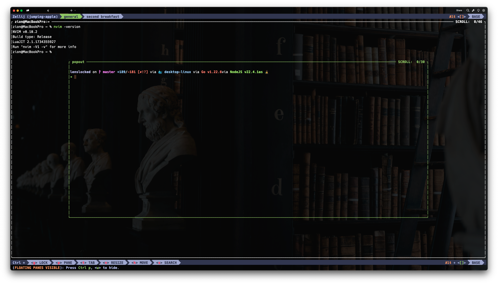

# 📦 Scaffold Config

 > 🚀 Scaffold a new machine from nothing to engineer readiness in 5 steps.

### ⚡Maintain the Iron Triangle: Velocity, Quality, & Affordable



## 🖥️ System

1. 🛠️ System settings

- Trackpad -> Trackpad scroll direction & tap to click modified
- Keyboard -> Key Repeat Fast and Delay Until Repeat Short
- General -> Default web browser Microsoft Edge & Appearance Theme Dark
- Edge Settings -> Make Google default Search Engine Privacy & Services Address Bar edge://settings/search
- Finder -> Root/Home Directory press Cmd+Shift+. to toggle/show hidden dot files
- Code Font -> [Dank Mono](dank.sh) or [Nerdfont's 0xProto Mono](https://www.nerdfonts.com/font-downloads)

## 💾 Install & Configure

2. 📈 Efficient order

- [Chrome](https://www.google.com/chrome/) + [Spotify](https://www.google.com/chrome/) (Stephan Moccio's Fracture on repeat during scaffold)
- [Warp](https://www.warp.dev/) terminal emulator + .zshrc
- [Homebrew](https://brew.sh/) package manager

```
/bin/bash -c "$(curl -fsSL https://raw.githubusercontent.com/Homebrew/install/HEAD/install.sh)"
```

- [LazyVim](https://www.lazyvim.org/) [(NVIM LTS: v0.10.2)](https://neovim.io/)
  - [2024 Setup Guide on YT helps](https://www.youtube.com/watch?v=6pAG3BHurdM)
- [Zellij](https://zellij.dev/) (Termial Workspace)
- [Starship](https://starship.rs/) (Cross-Shell prompt)
- Implement [dotfiles](https://github.com/frankfulness/dotfiles)
- Apple Account Sign In
- Apple iCloud Apps - [Flow](https://www.flow.app/blog/the-pomodoro-technique) (Pomodoro), [App Ahead apps - Keystroke Pro, Cursor Pro, Mirror Magnet, Theine, ](https://appahead.studio/apps/), [Magnet](https://appahead.studio/apps/cursor-pro/) (Window manager), [clipy](https://github.com/Clipy/Clipy), & [Dato](https://sindresorhus.com/dato) (Supreme Mac Calendar/Clock - Great for remote cross time-zone collaboration) [Flow](https://apps.apple.com/us/app/flow-focus-pomodoro-timer/id1423210932) Pomodoro for MacOS, nothing better or cleaner imo

- Xcode install (Automatically installs git)

```
sudo xcodebuild -license
xcode-select --install
```

- [OBS Studio](https://obsproject.com/download) + Ensure Shure Mic + Webcam are configured in sound
- [Raycast](https://www.raycast.com/) shortcut/productivity launcher (Superior to Spotlight w/ Ai)
- [f.lux](https://justgetflux.com/) (Preserve your eyesight)
- [Docker Desktop](https://docs.docker.com/desktop/setup/install/mac-install/)
- [Figma + FigJam](https://www.figma.com/downloa-ds/)
- [Affinity Photo 2](https://affinity.serif.com/en-us/photo/?srsltid=AfmBOorVeM-YZCqwdVr96g28zwoeVj9EO10ZVqoKRPOYG5pOnH7LhPDQ), [Affinity Design 2](https://affinity.serif.com/en-us/designer/), & [Affinity Publisher 2](https://affinity.serif.com/en-us/publisher/)
- [Keyboard Maestro](https://www.keyboardmaestro.com/main/) for automation macros
- [Notion](https://www.notion.com/desktop) Notetaking -> Swapping to [Zettelkasten](https://obsidian.rocks/getting-started-with-zettelkasten-in-obsidian/) in [Obsidian](https://obsidian.rocks/)
- [Typora](https://typora.io/) Notes static app for quick and dirty alternative to MacOS Notes
- [Postan](https://www.postman.com/downloads/) Testing APIs easily with import/export of collections

## 🎬 Finalize

3. 🗺️ Git

- [Generate new SSH key](https://docs.github.com/en/authentication/connecting-to-github-with-ssh/generating-a-new-ssh-key-and-adding-it-to-the-ssh-agent)
- [Add to GitHub/GitLab/BitBucket account settings](https://docs.github.com/en/authentication/connecting-to-github-with-ssh/adding-a-new-ssh-key-to-your-github-account)
- Set global GitHub username & email

```
git config --global user.name "Valiant Frank"
git config --global user.email "Valiant@x.com"
```

4. 🧑🏻‍🚀 Make any machine use case specific tweaks to .zshrc aliases, nvim plugin installs/lua settings, browser bookmarks, etc
5. 🎩 Download business folder that contains profile photo varations, wallpapers, banners, & AWS Secrets Manager or AWS Parameter Store (cheaper but less security features)
